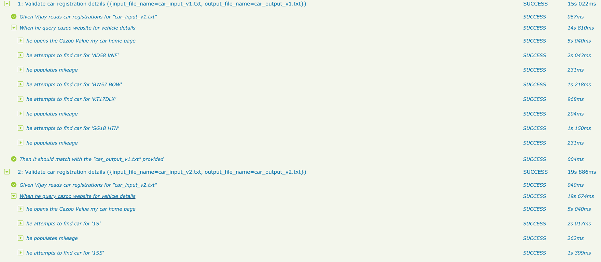

# Getting started with Serenity and Cucumber

Serenity BDD is a library that makes it easier to write high quality automated acceptance tests, with powerful reporting and living documentation features. It has strong support for both web testing with Selenium, and API testing using RestAssured.

Serenity strongly encourages good test automation design, and supports several design patterns, including classic Page Objects, the newer Lean Page Objects/ Action Classes approach, and the more sophisticated and flexible Screenplay pattern.

Serenity 2.2.13 introduced integration with WebdriverManager to download webdriver binaries.

## Executing the tests
To run the sample project, you can either just run the `CucumberTestSuite` test runner class, or run either `mvn verify` or `gradle test` from the command line.

By default, the tests will run using Chrome. You can run them in Firefox by overriding the `driver` system property, e.g.
```json
$ gradle clean test -Pdriver=firefox
```

The test results will be recorded in the `target/site/serenity` directory.

## Generating the reports
Since the Serenity reports contain aggregate information about all of the tests, they are not generated after each individual test (as this would be extremenly inefficient). Rather, The Full Serenity reports are generated by the `serenity-maven-plugin`. You can trigger this by running `mvn serenity:aggregate` from the command line or from your IDE.

The sample report will be shown as per the image below, quite comprehensive, it's good for debugging purposes




```
             <plugin>
                <groupId>net.serenity-bdd.maven.plugins</groupId>
                <artifactId>serenity-maven-plugin</artifactId>
                <version>${serenity.maven.version}</version>
                <configuration>
                    <tags>${tags}</tags>
                </configuration>
                <executions>
                    <execution>
                        <id>serenity-reports</id>
                        <phase>post-integration-test</phase>
                        <goals>
                            <goal>aggregate</goal>
                        </goals>
                    </execution>
                </executions>
            </plugin>
```

Serenity uses WebDriverManager to download the WebDriver binaries automatically before the tests are executed.

### Environment-specific configurations
We can also configure environment-specific properties and options, so that the tests can be run in different environments. Here, we configure three environments, __dev__, _staging_ and _prod_, with different starting URLs for each:
```json
environments {
  default {
    webdriver.base.url = "https://cazoo.com"
  }
  dev {
    webdriver.base.url = "https://cazoo.com/dev"
  }
  staging {
    webdriver.base.url = "https://cazoo.com/staging"
  }
  prod {
    webdriver.base.url = "https://cazoo.com/prod"
  }
}
```

You use the `environment` system property to determine which environment to run against. For example to run the tests in the staging environment, you could run:
'''json
$ mvn clean verify -Denvironment=staging
'''
